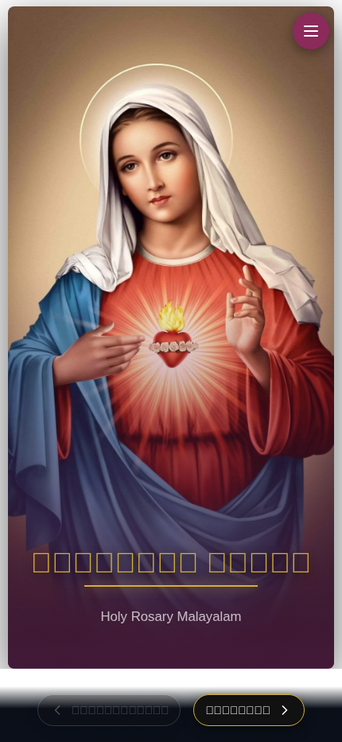
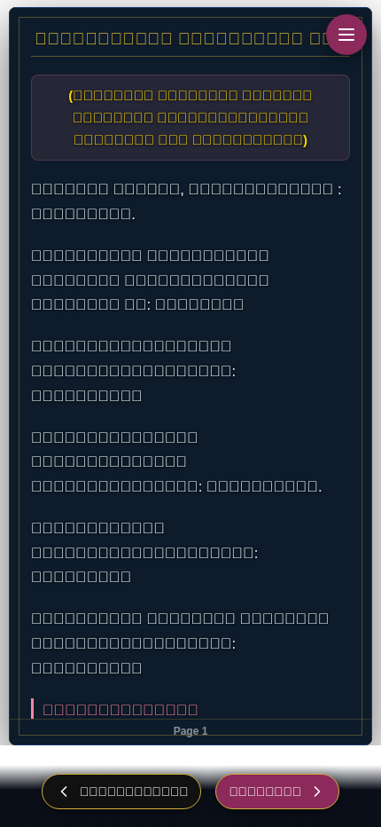
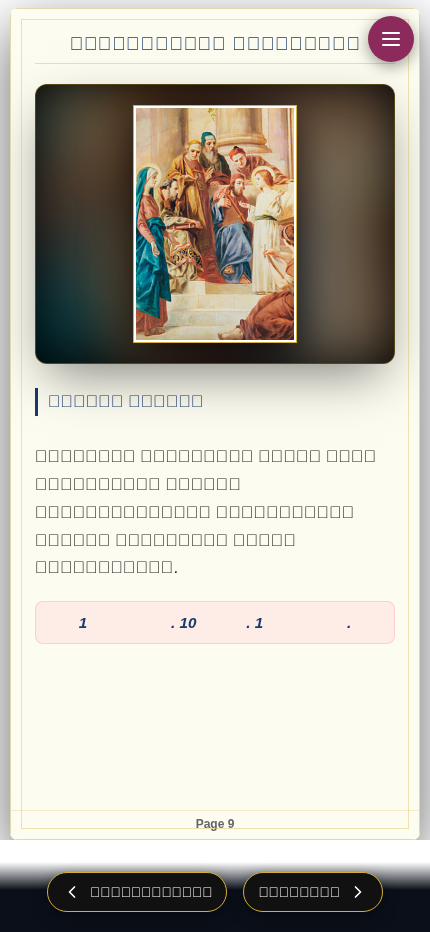
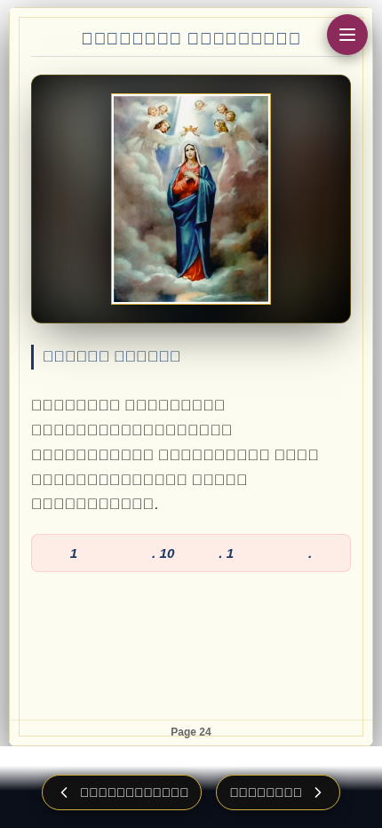
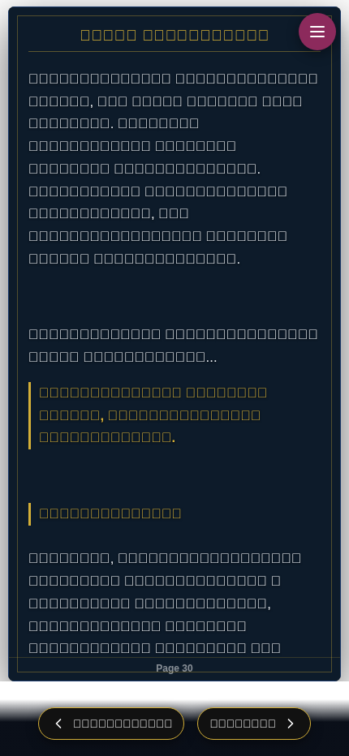

<div align="center">


# ✨ പരിശുദ്ധ ജപമാല ✨
### *Holy Rosary Malayalam — Digital Prayer Book*

<br/>

[](https://react.dev/)
[](https://vitejs.dev/)
[](https://developer.mozilla.org/en-US/docs/Web/JavaScript)
[](https://developer.mozilla.org/en-US/docs/Web/CSS)
[](https://en.wikipedia.org/wiki/Malayalam)

<br/>

[](https://github.com/AlinsBinuP/Japamala/stargazers)
[](https://github.com/AlinsBinuP/Japamala/network/members)
[](LICENSE)

<br/>

> 🌸 *"ഭക്തിയോടും ആദരവോടും കൂടി ജപമാല ചൊല്ലുക"*
> 
> *"Pray the Rosary with devotion and reverence"*

<br/>

**[🌐 Visit the App](https://alinsbinup.github.io/Japamala/) · [📖 Documentation](#-features) · [🚀 Get Started](#-getting-started)**

</div>

---

## 🌟 What is Japamala?

**Japamala** (ജപമാല) is a beautifully crafted, **mobile-first digital prayer book** that brings the sacred tradition of the **Holy Rosary** (Malayalam: *പരിശുദ്ധ ജപമാല*) to life on any device.

This app lets you journey through all **20 mysteries of the Rosary** — from the Joyful to the Glorious — in the melodic **Malayalam language**, complete with illustrated mystery cards, structured prayers, and the full Litany of Mary.

Designed to feel like an **actual prayer book**, it features:
- 🕯️ A **deep navy & gold** aesthetic evoking candlelit reverence
- 📖 Smooth **page-turn animations**  
- 🖼️ Rich **mystery illustrations** for every decade
- 📱 Buttery-smooth **responsive design** for phones & tablets

---

## 📱 Screenshots

<div align="center">

### 🏛️ Cover Page
*"The golden-glow gateway into sacred prayer"*



<br/><br/>

### 📜 Prayer Pages
*"Elegantly formatted Malayalam prayers with action cues"*



<br/><br/>

### 🗺️ Navigation Menu
*"Instant access to every section of the Rosary"*


<br/><br/>

### 🌸 Mystery Pages — Joyful Mysteries
*"Illustrated mystery cards with reflections and decade structure"*



<br/><br/>

### 👑 Glorious Mysteries
*"Sacred illustrations paired with deep devotional text"*



<br/><br/>

### 🕯️ Litany of Mary
*"The luminous closing Litany presented in bold dark-mode splendor"*



</div>

---

## 🔮 Features

<table>
<tr>
<td width="50%">

### 📿 Prayer Content
- ✅ **Full Holy Rosary** in Malayalam
- ✅ **4 Mystery Sets** — Joyful, Luminous, Sorrowful & Glorious
- ✅ **5 decades per mystery** with reflections
- ✅ Easter & Holy Week special prayers
- ✅ Angelus (Trisandhyajapam)
- ✅ Full **Litany of the Blessed Virgin Mary**
- ✅ Concluding prayers

</td>
<td width="50%">

### 🎨 Design & UX
- ✅ **Deep navy & gold** futuristic aesthetic
- ✅ **Page-flip animation** on every turn
- ✅ Full-bleed **mystery artwork** with blur backdrop
- ✅ Gold filigree border on every page
- ✅ **Smooth scroll** within pages
- ✅ **Bookmark** — resumes from your last page
- ✅ Fully **responsive** — phone, tablet, desktop

</td>
</tr>
<tr>
<td width="50%">

### 🧭 Navigation
- ✅ **Hamburger menu** with chapter shortcuts
- ✅ **Previous / Next** page controls
- ✅ **Live page counter** (e.g., *10 / 34*)
- ✅ Tap-outside-to-close overlay
- ✅ Keyboard-friendly design

</td>
<td width="50%">

### ⚡ Technical
- ✅ Built with **React 18** + **Vite 5**
- ✅ **Instant load** — no heavy libraries
- ✅ **LocalStorage** progress persistence
- ✅ **Malayalam font** (Noto Sans Malayalam)
- ✅ Fully **offline-capable** PWA-ready structure
- ✅ Zero external runtime dependencies except React

</td>
</tr>
</table>

---

## 🗂️ Content Structure

```
📖 Japamala — 34 Pages
│
├── 🌅  Page  0    — Front Cover (Holy Mary artwork)
├── 🌸  Pages 1–3  — Easter, Holy Week & Trisandhya Prayers
├── 📿  Pages 4–8  — Core Rosary Prayers (Creed, Our Father, Hail Mary…)
├── 😊  Pages 9–13 — Joyful Mysteries    (5 decades)
├── ✨  Pages 14–18 — Luminous Mysteries  (5 decades)
├── 😢  Pages 19–23 — Sorrowful Mysteries (5 decades)
├── 👑  Pages 24–29 — Glorious Mysteries  (5 decades)
├── 🕯️  Pages 30–32 — Litany of Mary
└── 🙏  Page  33   — Back Cover (Amen / God Bless)
```

---

## 🛠️ Tech Stack

| Technology | Version | Purpose |
|------------|---------|---------|
| ⚛️ **React** | 18.3.1 | Component-based UI framework |
| ⚡ **Vite** | 5.4.x | Blazing-fast build tool & dev server |
| 🎨 **CSS3** | — | Animations, variables, responsive design |
| 🔣 **Lucide React** | 0.378.0 | Crisp SVG navigation icons |
| 🔡 **Noto Sans Malayalam** | Google Fonts | Native Malayalam typography |
| 🔡 **Outfit** | Google Fonts | Modern Latin heading font |

---

## 🚀 Getting Started

### Prerequisites

- **Node.js** v18 or higher  
- **npm** v9 or higher

### Installation

```bash
# 1. Clone the repository
git clone https://github.com/AlinsBinuP/Japamala.git
cd Japamala

# 2. Install dependencies
npm install

# 3. Start the development server
npm run dev
```

Open your browser and navigate to **[http://localhost:5173](http://localhost:5173)** 🎉

### Build for Production

```bash
# Create an optimized production build
npm run build

# Preview the production build locally
npm run preview
```

---

## 📁 Project Structure

```
Japamala/
├── 📄 index.html              # App entry point (includes favicon)
├── 🗂️ public/
│   └── images/                # Mystery artwork & app icon
│       ├── appicon.jpeg       # 🔖 App favicon
│       ├── mothermary.png     # Cover image
│       ├── joyful_1–5.png     # Joyful mystery illustrations
│       ├── luminous_1–5.png   # Luminous mystery illustrations
│       ├── sorrowful_1–5.png  # Sorrowful mystery illustrations
│       ├── glorious_1–5.png   # Glorious mystery illustrations
│       └── litany.jpg         # Back cover / litany background
├── 🗂️ src/
│   ├── App.jsx                # Main application component
│   ├── main.jsx               # React DOM render entry
│   ├── index.css              # Global styles & theme variables
│   └── data/
│       └── rosaryContent.js   # All prayer content data
├── 🗂️ docs/
│   └── screenshots/           # README screenshot assets
├── ⚙️ vite.config.js           # Vite configuration
└── 📦 package.json            # Project dependencies & scripts
```

---

## 🖼️ App Icon / Favicon

The app icon used as the browser tab favicon:

<div align="center">

<br/>
<em>Located at <code>public/images/appicon.jpeg</code></em>
</div>

---

## 🤝 Contributing

Contributions, corrections to prayer texts, and new features are very welcome!

1. **Fork** the repository
2. Create a feature branch: `git checkout -b feature/my-improvement`
3. Commit your changes: `git commit -m 'Add some improvement'`
4. Push the branch: `git push origin feature/my-improvement`
5. Open a **Pull Request**

---

## 🌐 Deployment

The app is deployed on **GitHub Pages** and accessible at:

🔗 **[https://alinsbinup.github.io/Japamala/](https://alinsbinup.github.io/Japamala/)**

To deploy your own fork to GitHub Pages:

```bash
npm run build
# then push the dist/ folder to the gh-pages branch, or use GitHub Actions
```

---

## 📜 License

This project is open source. See the [LICENSE](LICENSE) file for details.

---

<div align="center">

### 🙏 *Ave Maria, gratia plena* 🙏

*Built with love and devotion for the Malayalam Catholic community.*

---


**Made with ❤️ by [AlinsBinuP](https://github.com/AlinsBinuP)**

[](https://github.com/AlinsBinuP/Japamala)

</div>
